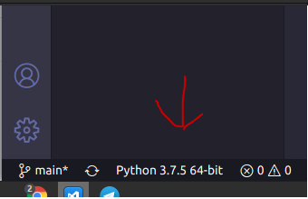

# Agregador de Links

## iniciar a virtualenv
Bizu supremo é usar uma venv :)
É um ambiente virtual para não ter problemas com versão do python
Pra instalar:

`$apt instal virtualenv`

Pra criar

`$virtualenv venv -p python3.8`

Pra ativar:

Daí, "enter path" > .venv/bin/python3

Pra instalar os pacotes necessários:
(certifique-se de que o terminal esteja com venv na frente, se não, reinicie o VSCode)

`pip install -r requirements.txt`